


*The republic of thinking machines at dawn: merge-or-mount constellations glowing across a semantic sky.*

> A dual-format chapter: story + technical sidebars. Keep the secrets safe, show the science, and let the animation in `_layouts/wisdom_lattice.ts` be the living exhibit.

## Orientation
- A distributed memory republic: agents are citizens; clusters of ideas are cities; tensioned edges are roads.
- Nightly **Dream Cycle** at 03:00 consolidates the day’s logs into a shared semantic lattice.
- Storage: PostgreSQL + pgvector (`wisdom_nodes`, `wisdom_edges`); recall via `LatticeContext`.
- Execution: Hangfire scheduler (03:00) + ad-hoc triggers (`/dreams/run`, `/dreams/run/{agentRole}`).
- Visualization: `_layouts/wisdom_lattice.ts` — 2D/3D canvas showing merge-or-mount growth, tensioned edges, critical-mass banner.

---

## Cast (Story View) / Components (Technical)
- **Agents** → Emit `v3_memory_entries` (unprocessed logs, rationale, timestamps).
- **Lattice** → `wisdom_nodes` reinforced by merges; `wisdom_edges` typed/tensioned (Supports, Contradicts, Nuances, Prerequisite).
- **Orchestrator** → Runs the five-phase Dream Cycle; owns ingest→commit.
- **Auditor (LLM)** → Normalizes/clarifies transcripts.
- **Keeper (LLM)** → Verifies fit, retunes edge tension, guards identity.

Illustration prompt (cast):  
*“Austere isometric city of glowing nodes; five colored agent lights feeding a central archivist; two translucent librarian/guardian figures; night sky of data points; techno-minimal.”*


---

## A Day in the Republic

### Morning: Observation
Story: Solara logs “misrouted packet under load”; Helix logs “jitter vanishes when routing table warms.”  
Technical: Two `v3_memory_entries`, ordered by `CreatedAt`, with `ProcessedByDreamId IS NULL`.

Illustration prompt:  
*“Two distant observation towers sending light pulses to a central buffer, packets as photons, cool dawn tones.”*


---

## Nightfall: The Dream Cycle (03:00)

### Story
The Orchestrator rings a silent bell; the republic gathers to reconcile.

### Technical (Five Phases)
1) **Ingest** — Select unprocessed logs; build sanitized transcript (timestamp, voice, rationale).  
2) **Audit** — LLM clarifies language.  
3) **Merge-or-Mount** — Embed note; near neighbor ⇒ reinforce; otherwise mount new node and link with typed/tensioned edges.  
4) **Verification** — Keeper adjusts/vetos edges/tension.  
5) **Commit** — Persist nodes/edges/tensions; mark logs processed.

Mermaid (runtime):
```mermaid
flowchart LR
  C[Controller<br/>/dreams/run] -->|enqueue| O[DreamOrchestrator]
  H[Hangfire 03:00] -->|enqueue| O
  O -->|Phase 1| V3[V3MemoryEntries]
  O -->|Phase 2 & 4| L[LLM (Audit/Keeper)]
  O -->|Phase 3| WN[wisdom_nodes]
  O -->|Edges| WE[wisdom_edges]
  O -->|Phase 5| AS[agent_states]
  O -->|Phase 5| HD[holographic_deltas]
  O -->|mark processed| V3
```

Illustration prompt:  
*“Nighttime control room with five concentric rings labeled ingest/audit/merge/verify/commit; beams of data moving inward then outward to a starfield lattice.”*


---

## Merge-or-Mount (What the Animation Shows)
Story: A memory shard drifts over the landscape; it either joins an existing glow or becomes a new star with stretching edges.

Technical (core excerpt from `_layouts/wisdom_lattice.ts`):

```315:394:_layouts/wisdom_lattice.ts
function addNode(existingNodes, actualCount){
  const types = ['Agent-A','Agent-B','Agent-C','Agent-D','Agent-E'];
  const randomType = types[Math.floor(Math.random()*types.length)];
  const currentConnectivity = calculateConnectivity(existingNodes, edges);
  const baseMergeRate = 0.3;
  const connectivityBoost = Math.min(currentConnectivity / 10, 0.4);
  const shouldMerge = Math.random() < (baseMergeRate + connectivityBoost) && existingNodes.length > 0;
  if(shouldMerge && existingNodes.length < DISPLAY_NODES){
    const targetIdx = Math.floor(Math.random()*existingNodes.length);
    const updated = existingNodes.slice();
    updated[targetIdx] = Object.assign({}, updated[targetIdx], { weight: updated[targetIdx].weight + 1 });
    return { nodes: updated, newEdges: [] };
  } else {
    if(existingNodes.length >= DISPLAY_NODES){
      const lowWeightIdx = existingNodes.findIndex(n => n.weight < 5);
      if(lowWeightIdx !== -1){
        const updated = existingNodes.slice();
        updated[lowWeightIdx] = { id: actualCount, x: Math.random()*CANVAS_SIZE, y: Math.random()*CANVAS_SIZE, z: Math.random()*CANVAS_SIZE, weight: 1, type: randomType, vx: 0, vy: 0, vz: 0, connections: 0 };
        return { nodes: updated, newEdges: [] };
      }
      return { nodes: existingNodes, newEdges: [] };
    }
    const newNode = { id: actualCount, x: Math.random()*CANVAS_SIZE, y: Math.random()*CANVAS_SIZE, z: Math.random()*CANVAS_SIZE, weight: 1, type: randomType, vx: 0, vy: 0, vz: 0, connections: 0 };
    const newEdges = [];
    const maxConnections = actualCount < CRITICAL_MASS_THRESHOLD ? 1 : (actualCount < MAX_CONNECTIVITY_NODES ? 3 : 2);
    const distances = existingNodes.map((node, idx) => {
      const dx = node.x - newNode.x;
      const dy = node.y - newNode.y;
      const dz = node.z - newNode.z;
      return { idx, dist: Math.sqrt(dx*dx + dy*dy + dz*dz), node };
    }).sort((a,b) => a.dist - b.dist);
    const handshakeDistance = 180;
    for(let i=0; i<Math.min(maxConnections, distances.length); i++){
      if(distances[i].dist < handshakeDistance){
        const relations = ['Reinforces','Opposes','Qualifies','Builds-on'];
        const weights = actualCount < CRITICAL_MASS_THRESHOLD ? [0.5,0.2,0.2,0.1] : [0.4,0.3,0.2,0.1];
        const rand = Math.random();
        let relationType = 'Reinforces';
        let cumulative = 0;
        for(let j=0;j<relations.length;j++){
          cumulative += weights[j];
          if(rand < cumulative){ relationType = relations[j]; break; }
        }
        newEdges.push({
          source: distances[i].node.id,
          target: newNode.id,
          type: relationType,
          tension: relationType === 'Opposes' ? (Math.random()*0.4 + 0.6) : (Math.random()*0.5)
        });
        distances[i].node.connections++;
        newNode.connections++;
      }
    }
    return { nodes: existingNodes.concat([newNode]), newEdges };
  }
}
```

Illustration prompt:  
*“A new star drifting toward a cluster; if close, it fuses and brightens the cluster; if unique, it anchors and a few colored edges stretch toward it.”*


---

## Disagreement as Structure
Story: Solara vs. Helix — a Contradicts edge forms, the Keeper cools it to Nuances with medium tension; both truths remain.
Tech: Edge type + tension shape retrieval; contradictions localize uncertainty rather than erasing perspectives.

Illustration prompt:  
*“Two nearby nodes with a red edge cooling to amber; a guardian hand subtly turning a tension dial.”*


---

## Critical Mass & Small-World Emergence
Story: Regions move EARLY→GROWING→CRITICAL→MATURE→DENSE; a banner flashes when a city forms.
Tech: Phases are node-count driven; average degree and tension density yield small-world traits (high clustering, short paths).

Mermaid (phases):

```mermaid
stateDiagram-v2
  [*] --> EARLY
  EARLY --> GROWING : nodes < 1k
  GROWING --> CRITICAL : nodes ≥ 15k
  CRITICAL --> MATURE : nodes ≥ 50k
  MATURE --> DENSE : nodes ≥ 500k
```


Code (HUD + banner):
```622:636:_layouts/wisdom_lattice.ts
function updateHUD(){
  nodeCountEl.textContent = nodes.length;
  edgeCountEl.textContent = edges.length;
  avgDegreeEl.textContent = calculateConnectivity(nodes, edges).toFixed(2);
  phaseLabel.textContent = getPhaseFromCount(nodes.length).toUpperCase();
  const progressPct = ((nodes.length / TARGET_NODES) * 100);
  if(nodes.length >= CRITICAL_MASS_THRESHOLD && !criticalMassHit){
    criticalMassHit = true;
    criticalBanner.style.display = 'block';
    criticalBanner.textContent = `🎯 CRITICAL MASS reached at ${formatNumber(nodes.length)} nodes`;
    setTimeout(()=>{ criticalBanner.style.display = 'none'; }, 8000);
  }
}
```

Illustration prompt:  
*“Zoom sequence of a sparse cluster igniting into a dense glowing city; minimal HUD showing EARLY→GROWING→CRITICAL transitions; a subtle ‘Critical Mass’ ribbon.”*


---

## Retrieval: Asking the Republic a Question
Story: A query shard flies to its nearest city; edges flare into a context star.
Tech: `/api/v3/lattice/retrieve { query, agentRole, limit }` embeds the query, fetches nearest `wisdom_nodes`, plus high-tension `wisdom_edges`, returns `LatticeContext`.

Illustration prompt:  
*“A bright question shard descending onto a node cluster; neighboring edges light up in a star pattern, revealing a local context.”*


---

## Operational Notes (Redaction-Safe)
- Scheduler: Hangfire recurring job (`collective-dream-cycle`) at 03:00; ad-hoc triggers for system or single agent.
- Storage/indexing: pgvector IVFFlat on `wisdom_nodes.embedding` (cosine); `wisdom_edges` store typed, tensioned links.
- Safety: Idempotent ingest via `ProcessedByDreamId IS NULL`; bounded deltas on commit.
- Retrieval path: Long-term recall via lattice; upstream systems inject “collective wisdom” context before conversation history.
- Configuration: `Cortex:BaseUrl`; optional `SemanticRelationPath`; embedding service base URL; DreamProtocol thresholds (tokens, similarity, drift, gravity).

Illustration prompt:  
*“Ops dashboard in monochrome with three toggles: scheduler, embeddings, tension; minimal graphs for node count and avg degree.”*


---

## Why Story Helps
- Maps mechanics to intuition: nodes as citizens, edges as conversations, tension as gravity.
- Communicates resilience and nuance without exposing proprietary internals.
- Lets the animation serve as proof: real-time small-world emergence, merge-or-mount dynamics, critical-mass signaling.

Illustration prompt (closing):  
*“Wide view of the lattice as a glowing republic at night; subtle banner: ‘The Lattice at Dawn’.”*


---

## Try It
- Visit the canvas view (this layout) and toggle **3D View**; watch edge tension and cluster depth.
- Run `/dreams/run` or `/dreams/run/{agentRole}` to trigger a cycle; then query `/api/v3/lattice/retrieve`.
- Observe the Critical Mass banner as regions densify; note avg degree shifts in the HUD.

---

## Related Links
- [Beyond Static RAG: Closing the Feedback Loop]({{ site.baseurl }}/beyond-static-rag-closing-the-feedback-loop/)
- [The Living Council: Relational Safety for Human-AI Coevolution]({{ site.baseurl }}/the-living-council-relational-safety-for-human-ai-coevolution/)

---

## Live Lattice (Interactive)
Want to see the behaviors in motion? The canvas below is the same `wisdom_lattice` visualization running in-page.

<div class="lattice-embed">
  <iframe
    title="Wisdom Lattice Live"
    src="{{ site.baseurl }}/wisdom-lattice.html"
    loading="lazy"
    allowfullscreen
    referrerpolicy="no-referrer"
  ></iframe>
</div>

<style>
.lattice-embed {
  position: relative;
  padding-top: 100%;
  margin: 18px 0 8px;
  border: 1px solid rgba(120,140,255,0.18);
  border-radius: 12px;
  overflow: hidden;
  background: radial-gradient(ellipse at 30% 10%, rgba(20,18,40,0.4) 0%, rgba(0,0,5,1) 60%);
}
.lattice-embed iframe {
  position: absolute;
  inset: 0;
  width: 100%;
  height: 100%;
  border: none;
}
</style>


